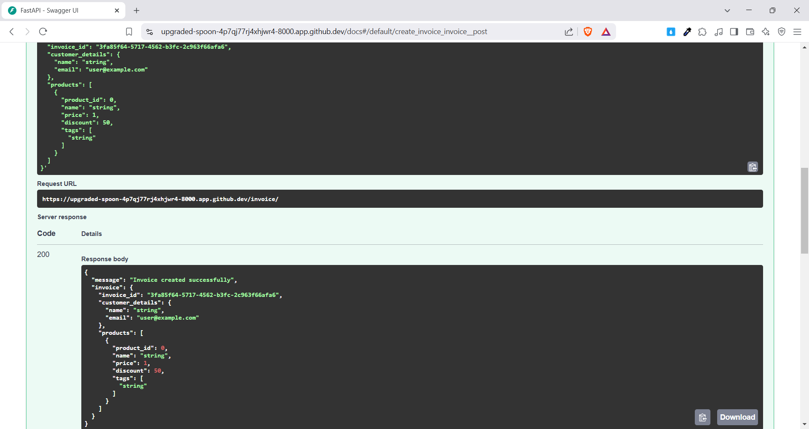

# SOA - HOMEWORK 07

```sh
Huynh Thanh Liem - 52100813
```

## Introduction

This assignment is a simple API application built with FastAPI, allowing users to create invoices with detailed information about customers and products. The API supports complex fields and optional fields while performing input data validation using Pydantic.

## Objectives

The objectives of this assignment are:
- Create an endpoint `/invoice/` to receive invoice creation requests.
- Use nested models to organize data.
- Implement input data validation with specific conditions for each field.

## Project Structure

The project includes the following models:

1. **Product**: Represents a product in the invoice.
   - `product_id`: Product ID (required).
   - `name`: Product name (required, minimum 3 characters).
   - `price`: Product price (required, must be greater than 0).
   - `discount`: Discount (optional, between 0 and 50%).
   - `tags`: List of tags (optional).

2. **CustomerDetails**: Represents customer information.
   - `name`: Customer name (required).
   - `email`: Customer email address (required, must be a valid email format).

3. **Invoice**: Represents an invoice.
   - `invoice_id`: Invoice ID (UUID, required).
   - `customer_details`: Customer details (required).
   - `products`: List of products (required).

## How to Run the Application

1. **Install required packages**:
   ```bash
   pip install fastapi[all] pydantic
   ```

2. **Run the application**:
   Save the source code in a file named `main.py` and execute the following command:
   ```bash
   uvicorn main:app --reload
   ```

3. **Send API requests**:
   Use Postman or cURL to send a POST request to the `/invoice/` endpoint with JSON data. Below is an example JSON request:

   ```json
   {
       "invoice_id": "123e4567-e89b-12d3-a456-426614174000",
       "customer_details": {
           "name": "John Doe",
           "email": "john.doe@example.com"
       },
       "products": [
           {
               "product_id": 1,
               "name": "Product A",
               "price": 100.0,
               "discount": 10.0,
               "tags": ["tag1", "tag2"]
           },
           {
               "product_id": 2,
               "name": "Product B",
               "price": 50.0
           }
       ]
   }
   ```

4. **Response result**:


